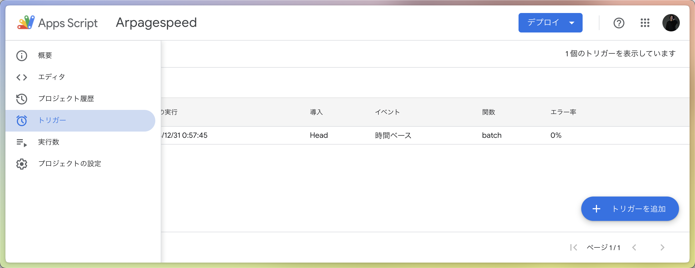
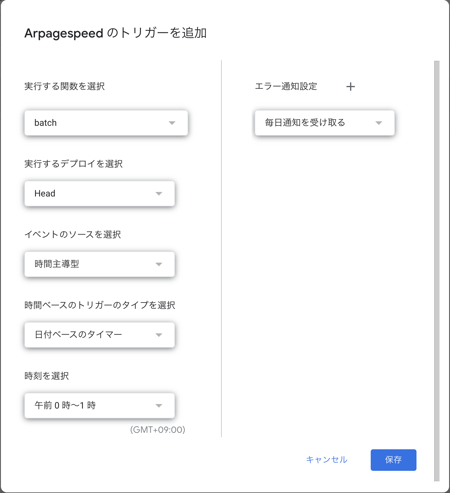

# Page Speed Aggregator

## 準備
```
npm install -g @google/clasp
```

## Claspの準備

Spreadsheetを作成するGoogleアカウントを選択します
```
clasp login
```

このプロジェクトに紐づいたSheetを作成します
```
clasp create --type sheets
```

## Install deps
```
yarn
```

## 反映
```
yarn push
```

## データを集めたいURLをSpread Sheetに入力する
- `URLs`という名前のシートを作成します
- A列に名前、B列にURLを入力してください

A列の名前でシートが作成され、そのシートにB列のURLの結果が挿入されるようになります。

|  |  |
|:-----------|------------:|
| TOP       | https://autoreserve.com/ja/        |
| ホーム     | https://autoreserve.com/ja/jp      |
| 検索       | https://autoreserve.com/ja/?keyword=%E6%96%B0%E5%AE%BF%E9%A7%85 |
| レストラン  | https://autoreserve.com/ja/restaurants/ygJncRkni7pVoBoMWHXg |

## Apps Scriptにスケジュールトリガーをつける

画面左のメニューから「トリガー」を選択し、トリガー一覧画面を表示し、「トリガーを追加」をクリック。



以下のように入力して保存してください。

- 実行する関数 `batch`
- 実行するデプロイを選択 `Head`
- イベントのソースを選択 `時間主導型`
- 時間ベースのトリガーのタイプを選択 `日付ベースのタイマー`
- 時刻を選択 `午前0時 ~ 1時`



これでスケジュールの設定は完了です。